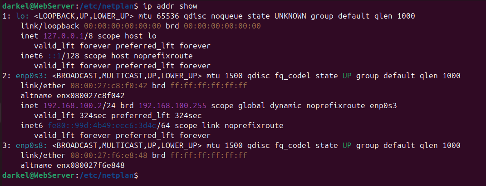

# Rapport de TP : Infrastructure Réseau Complète - DHCP, DNS et Serveur Web

## Table des Matières

1. [Introduction](#1-introduction)
2. [Objectifs du TP](#2-objectifs-du-tp)
3. [Architecture du Réseau](#3-architecture-du-réseau)
4. [Matériel et Logiciels Utilisés](#4-matériel-et-logiciels-utilisés)
5. [Configuration du Serveur DHCP](#5-configuration-du-serveur-dhcp)
6. [Configuration du Serveur DNS](#6-configuration-du-serveur-dns)
7. [Configuration du Serveur Web](#7-configuration-du-serveur-web)
8. [Configuration du Client](#8-configuration-du-client)
9. [Tests et Validation](#9-tests-et-validation)
10. [Problèmes Rencontrés et Solutions](#10-problèmes-rencontrés-et-solutions)
11. [Conclusion](#11-conclusion)
12. [Annexes](#12-annexes)

---

## 1. Introduction

Ce travail pratique a pour objectif la mise en place d'une infrastructure réseau complète comprenant un serveur DHCP pour l'attribution automatique des adresses IP, un serveur DNS pour la résolution de noms de domaine, et un serveur web hébergeant un site accessible via un nom de domaine. L'ensemble est virtualisé avec des machines Debian.

---

## 2. Objectifs du TP

### Objectifs techniques :

- [x] Configurer un serveur DHCP sous Debian
- [x] Configurer un serveur DNS statique sous Debian
- [x] Installer et configurer un serveur web avec XAMPP
- [x] Faire communiquer toutes les machines
- [x] Accéder au site web via un nom de domaine

### Objectifs pédagogiques :

- Comprendre l'interaction entre les services réseau
- Maîtriser la configuration des services sous Linux
- Savoir diagnostiquer et résoudre des problèmes réseau

---

## 3. Architecture du Réseau

### Schéma de l'infrastructure :

```
┌─────────────────────────────────────────────────┐
│         Réseau Interne VirtualBox               │
│                192.168.100.0/24                 │
├─────────────────────────────────────────────────┤
│                                                 │
│  ┌──────────────┐    ┌──────────────┐          │
│  │ Serveur      │    │ Serveur Web  │          │
│  │ DHCP + DNS   │────│   XAMPP      │          │
│  │ Debian 12    │    │  Debian 12   │          │
│  │ 192.168.100.1│    │ 192.168.100.2│          │
│  └──────────────┘    └──────────────┘          │
│           │                                     │
│           │                              ┌──────────────┐
│           └──────────────────────────────│   Client     │
│                                          │ Windows/Linux│
│                                          │ IP: DHCP     │
│                                          └──────────────┘
└─────────────────────────────────────────────────┘
```

### Table d'adressage IP :

| Machine   | Adresse IP     | Nom DNS         | Rôle     | Services                   |
| --------- | -------------- | --------------- | -------- | -------------------------- |
| Serveur 1 | 192.168.100.1  | dhcp-dns.tp.lan | DHCP/DNS | ISC DHCP, BIND9            |
| Serveur 2 | 192.168.100.2  | web.tp.lan      | Web      | XAMPP (Apache, MySQL, PHP) |
| Client    | DHCP (100-200) | client.tp.lan   | Accès    | Navigateur web             |

---

## 4. Matériel et Logiciels Utilisés

### Configuration matérielle :

- **VirtualBox 7.0** ou **VMware Workstation**
- **Processeur** : Intel Core i5 ou équivalent
- **RAM** : 4 Go (1.5 Go/serveur, 1 Go/client)
- **Stockage** : 20-30 Go par machine

### Logiciels :

- **Système d'exploitation** : Debian 12 "Bookworm"
- **Serveur DHCP** : ISC DHCP Server 4.4
- **Serveur DNS** : BIND9 9.18
- **Serveur Web** : XAMPP 8.2.0 (Apache 2.4, PHP 8.2, MySQL)
- **Outils** : net-tools, dnsutils, bind9utils

---

## 5. Configuration du Serveur DHCP

### 5.1 Installation des paquets

**Commande exécutée :**

```bash
sudo apt update && sudo apt upgrade -y
sudo apt install isc-dhcp-server -y
```

### 5.2 Configuration réseau statique

**Fichier : `/etc/network/interfaces`**

```bash
# This file describes the network interfaces available on your system
# and how to activate them. For more information, see interfaces(5).

source /etc/network/interfaces.d/*

# The loopback network interface
auto lo
iface lo inet loopback
# Interface pour le réseau DHCP (Réseau interne)
auto enp0s3
iface enp0s3 inet static
    address 192.168.100.1
    netmask 255.255.255.0
    network 192.168.100.0
    broadcast 192.168.100.255
auto enp0s8
iface enp0s8 inet dhcp

```

### 5.3 Configuration du serveur DHCP

**Fichier : `/etc/dhcp/dhcpd.conf`**

```bash
# ========================================================
# CONFIGURATION DHCP - TP RESEAU
# Serveur : 192.168.100.1
# Domaine : tp.lan
# Date : $(date)
# ========================================================

# 1. PARAMÈTRES GLOBAUX
default-lease-time 600;          # 10 minutes
max-lease-time 7200;             # 2 heures
authoritative;                   # Ce serveur fait autorité

# 2. OPTIONS RÉSEAU
option domain-name "tp.lan";
option domain-name-servers 192.168.100.1, 8.8.8.8;
option subnet-mask 255.255.255.0;
option routers 192.168.100.1;
option broadcast-address 192.168.100.255;

# 3. JOURNALISATION
log-facility local7;

# ========================================================
# 4. DÉFINITION DU SOUS-RÉSEAU
# ========================================================
subnet 192.168.100.0 netmask 255.255.255.0 {

    # 4.1 Plage d'adresses dynamiques
    range 192.168.100.100 192.168.100.200;

    # 4.2 Options pour ce sous-réseau
    option routers 192.168.100.1;
    option subnet-mask 255.255.255.0;
    option broadcast-address 192.168.100.255;
    option domain-name-servers 192.168.100.1;
    option domain-name "tp.lan";

    # ========================================================
    # 5. RÉSERVATIONS STATIQUES
    # ========================================================

    # Serveur Web (XAMPP)
    host webserver {
        hardware ethernet 08:00:27:c8:f0:42;
        fixed-address 192.168.100.2;
        option host-name "web-server";
    }

    # Exemple : Client Windows
    host client-windows {
        hardware ethernet 08:00:27:aa:bb:cc;
        fixed-address 192.168.100.50;
        option host-name "client-pc";
    }

    # Exemple : Client Linux
    host client-linux {
        hardware ethernet 08:00:27:dd:ee:ff;
        fixed-address 192.168.100.51;
        option host-name "ubuntu-client";
    }
}
# ========================================================
# FIN DE LA CONFIGURATION
# ========================================================

```

### 5.4 Configuration de l'interface d'écoute

**Fichier : `/etc/default/isc-dhcp-server`**

```bash
# Defaults for isc-dhcp-server (sourced by /etc/init.d/isc-dhcp-server)

# Path to dhcpd's config file (default: /etc/dhcp/dhcpd.conf).
#DHCPDv4_CONF=/etc/dhcp/dhcpd.conf
#DHCPDv6_CONF=/etc/dhcp/dhcpd6.conf

# Path to dhcpd's PID file (default: /var/run/dhcpd.pid).
#DHCPDv4_PID=/var/run/dhcpd.pid
#DHCPDv6_PID=/var/run/dhcpd6.pid

# Additional options to start dhcpd with.
#	Don't use options -cf or -pf here; use DHCPD_CONF/ DHCPD_PID instead
#OPTIONS=""

# On what interfaces should the DHCP server (dhcpd) serve DHCP requests?
#	Separate multiple interfaces with spaces, e.g. "eth0 eth1".
INTERFACESv4="enp0s3"
INTERFACESv6=""

```

### 5.5 Démarrage et activation

**Commandes exécutées :**

```bash
sudo systemctl start isc-dhcp-server
sudo systemctl enable isc-dhcp-server
sudo systemctl status isc-dhcp-server
```

---

## 6. Configuration du Serveur DNS

### 6.1 Installation des paquets

**Commande exécutée :**

```bash
sudo apt install bind9 bind9utils bind9-doc dnsutils -y
```

### 6.2 Configuration des options

**Fichier : `/etc/bind/named.conf.options`**

```bash
options {
    directory "/var/cache/bind";

    // CORRECTION : Écoute sur TOUTES les interfaces
    listen-on port 53 { any; };
    listen-on-v6 port 53 { none; };

    // Autoriser les requêtes du réseau local
    allow-query { localhost; 192.168.100.0/24; };

    // Récursivité autorisée
    recursion yes;
    allow-recursion { localhost; 192.168.100.0/24; };

    // Forwarders vers DNS externes
    forwarders {
        8.8.8.8;
        8.8.4.4;
    };

    // DNSSEC
    dnssec-validation auto;

    // Masquer la version pour la sécurité
    version "not currently available";

    auth-nxdomain no;
};

```

### 6.3 Déclaration des zones

**Fichier : `/etc/bind/named.conf.local`**

```bash
//
// Do any local configuration here
//

// Zone directe
# Remplacer monreseau.lan par tp.lan
zone "tp.lan" {
    type master;
    file "/etc/bind/db.tp.lan";
};

zone "100.168.192.in-addr.arpa" {
    type master;
    file "/etc/bind/db.192.168.100";
};

```

### 6.4 Zone directe

**Fichier : `/etc/bind/db.tp.lan`**

```bash
$TTL    86400
@       IN      SOA     dhcp-dns.tp.lan. admin.tp.lan. (
                        2024011501      ; Serial
                        3600            ; Refresh
                        1800            ; Retry
                        604800          ; Expire
                        86400 )         ; Minimum TTL

; Serveurs de noms
@       IN      NS      dhcp-dns.tp.lan.

; --- ENREGISTREMENTS A ---
; Serveurs
dhcp-dns        IN      A       192.168.100.1
web             IN      A       192.168.100.2
www             IN      A       192.168.100.2

; Clients (prédéfinis pour réservation DHCP)
client-fixe     IN      A       192.168.100.50

; --- ALIAS CNAME ---
webserver       IN      CNAME   web.tp.lan.
site            IN      CNAME   web.tp.lan.

```

### 6.5 Zone inverse

**Fichier : `/etc/bind/db.192.168.100`**

```bash
; Zone inverse pour 192.168.100.0/24
$TTL    86400
@       IN      SOA     dhcp-dns.tp.lan. admin.tp.lan. (
                        2024011501
                        3600
                        1800
                        604800
                        86400 )

@       IN      NS      dhcp-dns.tp.lan.

; --- ENREGISTREMENTS PTR ---
1       IN      PTR     dhcp-dns.tp.lan.
2       IN      PTR     web.tp.lan.
2       IN      PTR     www.tp.lan.
50      IN      PTR     client-fixe.tp.lan.

```

### 6.6 Vérification et démarrage

**Commandes exécutées :**

```bash
sudo named-checkconf
sudo named-checkzone tp.lan /etc/bind/db.tp.lan
sudo systemctl start bind9
sudo systemctl enable bind9
```

---

## 7. Configuration du Serveur Web

### 7.1 Installation de XAMPP

**Commandes exécutées :**

```bash
wget https://www.apachefriends.org/xampp-files/8.2.0/xampp-linux-x64-8.2.0-0-installer.run
chmod +x xampp-linux-x64-8.2.0-0-installer.run
sudo ./xampp-linux-x64-8.2.0-0-installer.run
```

### 7.2 Configuration Apache

**Fichier : `/opt/lampp/etc/httpd.conf`**

```bash
# Ligne ~228 : Définir le nom du serveur
ServerName web.tp.lan:80

# Ligne ~52 : Spécifier l'interface d'écoute
Listen 192.168.100.2:80

# Ligne ~487 : Activer les virtual hosts (décommenter)
Include etc/extra/httpd-vhosts.conf
```

**Fichier : `/opt/lampp/etc/extra/httpd-vhosts.conf`**

```bash
<VirtualHost 192.168.100.2:80>
    ServerAdmin admin@tp.lan
    DocumentRoot "/opt/lampp/htdocs/web"
    ServerName web.tp.lan
    ServerAlias www.tp.lan
    ErrorLog "logs/web-error.log"
    CustomLog "logs/web-access.log" common

    <Directory "/opt/lampp/htdocs/web">
        Options Indexes FollowSymLinks
        AllowOverride All
        Require all granted
    </Directory>
</VirtualHost>
```

### 7.3 Structure du site web

**Arborescence :**

```
/opt/lampp/htdocs/web/
/web
 ├── /Config
 │    └── Database.php       # Connexion à la BDD (Singleton PDO)
 ├── /controllers            # LOGIQUE MÉTIER
 │    ├── /admin             # Contrôleurs Admin (Dashboard, Users, Results...)
 │    ├── /auth              # Authentification (Login, Register, Logout)
 │    ├── /prof              # Contrôleurs Prof (Saisie des notes, Matières)
 │    └── /student           # Contrôleur Étudiant (Bulletin, PDF)
 ├── /models                 # ACCÈS AUX DONNÉES (CRUD)
 │    ├── User.php           # Gestion des utilisateurs
 │    ├── NoteModel.php      # Gestion des notes (Insert/Update)
 │    ├── Period.php         # Gestion des semestres
 │    ├── Result.php         # Calculs des délibérations
 │    └── ... (Subject, Assignment, Formula)
 ├── /vendor                 # Librairies externes (Dompdf) - Généré par Composer
 ├── /views                  # INTERFACE UTILISATEUR
 │    ├── /admin             # Pages Admin
 │    ├── /auth              # Pages Login/Register
 │    ├── /layout            # Header et Footer communs
 │    ├── /prof              # Pages Professeur
 │    └── dashboard.php      # Page d'accueil Étudiant
 └── index.php               # ROUTEUR PRINCIPAL (Point d'entrée unique)
```

### 7.5 Démarrage des services

**Commandes exécutées :**

```bash
sudo /opt/lampp/lampp start
sudo /opt/lampp/lampp status
```

---

## 8. Configuration du Client

**Client Windows**

- Configuration manuelle dans les paramètres réseau
- Serveur DNS : 192.168.100.1
- Serveur DNS secondaire : 8.8.8.8

---

## 9. Tests et Validation

### 9.1 Tests DHCP

**Commandes exécutées :**

```bash
# Sur le client
sudo dhclient -r
sudo dhclient -v
ip addr show
```



### 9.2 Tests DNS

**Commandes exécutées :**

```bash
# Test de résolution
nslookup web.tp.lan 192.168.100.1
dig @192.168.100.1 web.tp.lan
host web.tp.lan 192.168.100.1

# Test de résolution inverse
nslookup 192.168.100.2 192.168.100.1

# Résultats attendus :
# web.tp.lan → 192.168.100.2
# 192.168.100.2 → web.tp.lan
```

### 9.3 Tests Web

**Commandes exécutées :**

```bash
# Test d'accès
curl -I http://web.tp.lan
curl http://web.tp.lan
wget http://web.tp.lan

# Résultat attendu : Code HTTP 200
```

### 9.4 Vérification des services

**Commandes exécutées :**

```bash
# Vérification DHCP
sudo systemctl status isc-dhcp-server

# Vérification DNS
sudo systemctl status bind9
sudo ss -tulpn | grep :53

# Vérification Web
sudo /opt/lampp/lampp status
```

### 9.5 Tableau de validation

| Test               | Méthode                  | Résultat attendu           | Statut |
| ------------------ | ------------------------ | -------------------------- | ------ |
| Attribution IP     | `ip addr show`           | IP dans plage 100-200      | √      |
| Résolution DNS     | `nslookup web.tp.lan`    | 192.168.100.2              | √      |
| Alias DNS          | `nslookup www.tp.lan`    | web.tp.lan → 192.168.100.2 | √      |
| Résolution inverse | `nslookup 192.168.100.2` | web.tp.lan                 | √      |
| Accès web          | `curl http://web.tp.lan` | HTTP 200                   | √      |
| Services           | `systemctl status`       | Actifs (running)           | √      |

---

## 10. Problèmes Rencontrés et Solutions

### 10.1 Problème : Service DHCP ne démarre pas

**Symptôme :**

```
Job for isc-dhcp-server.service failed because the control process exited with error code.
```

**Cause :** Syntaxe incorrecte dans `/etc/dhcp/dhcpd.conf`

**Solution :**

```bash
# Tester la configuration
sudo dhcpd -t -cf /etc/dhcp/dhcpd.conf
```

### 10.2 Problème : DNS inaccessible depuis le réseau

**Symptôme :**

```
nslookup web.tp.lan 192.168.100.1
;; communications error to 192.168.100.1#53: connection refused
```

**Cause :** BIND9 configuré pour n'écouter que sur localhost

**Solution :**

```bash
# Modifier /etc/bind/named.conf.options
# Remplacer :
# listen-on port 53 { 127.0.0.1; };
# Par :
# listen-on port 53 { any; };

sudo systemctl restart bind9
```

**Vérification :**

```bash
sudo ss -tulpn | grep :53
# Doit afficher : 192.168.100.1:53
```

### 10.3 Problème : Site web inaccessible via nom de domaine

**Symptôme :** Site accessible via IP mais pas via nom de domaine

**Cause :** Configuration DNS incorrecte ou résolution échouée

**Solution :**

1. Vérifier la zone DNS : `cat /etc/bind/db.tp.lan`
2. Vérifier la résolution : `nslookup web.tp.lan 192.168.100.1`
3. Vérifier la configuration du client : `cat /etc/resolv.conf`

### 10.4 Tableau de dépannage

| Symptôme          | Commande de diagnostic          | Solution                        |
| ----------------- | ------------------------------- | ------------------------------- |
| Pas d'IP          | `journalctl -u isc-dhcp-server` | Vérifier plage DHCP             |
| DNS échoue        | `named-checkconf`               | Corriger syntaxe BIND9          |
| Web inaccessible  | `curl -v http://web.tp.lan`     | Vérifier Apache et DNS          |
| Connexion refusée | `ss -tulpn \| grep :53`         | Configurer `listen-on { any; }` |

---

## 11. Conclusion

√ **Infrastructure complète opérationnelle :**

- Serveur DHCP attribuant automatiquement les adresses IP
- Serveur DNS résolvant les noms de domaine localement
- Serveur web accessible via nom de domaine
- Interconnexion fonctionnelle entre tous les services

√ **Compétences acquises :**

- Administration des services réseau sous Linux
- Configuration avancée de BIND9 et ISC DHCP
- Diagnostic et résolution de problèmes réseau
- Intégration de services multiples

---

## 12. Annexes

**Commandes utiles**

```bash
# Vérifier la connectivité
ping -c 4 192.168.100.1
traceroute 192.168.100.2

# Vérifier les DNS
dig ANY tp.lan
host -a web.tp.lan

# Vérifier les services
netstat -tulpn
ss -tulpn
```

---

**Rapport généré le :** 19 janvier 2026  
**Nom de l'étudiant :** [METOGHE OBIANG Simplice Dariel]
